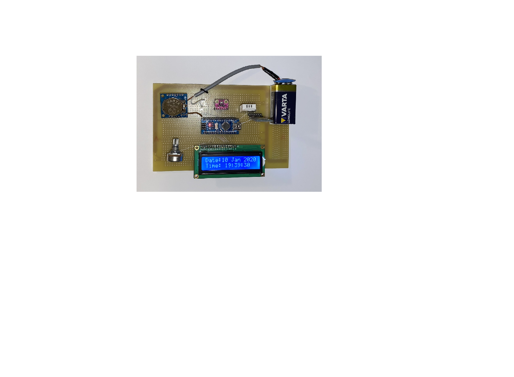
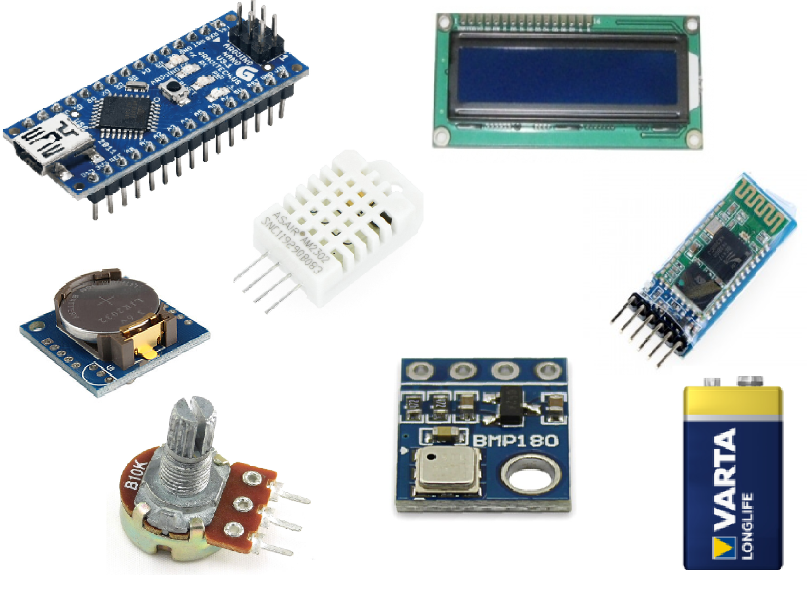
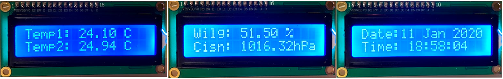

# Kurs IO LAB , rok akademicki 2019/20 .

|  Temat projektu : | Stacja pogodowa  |
| :------------: | :------------: |
|  Autorzy :  |  Przemys³aw Widz , Oskar Wiêckowicz   |
| Prowadz¹cy :  | Mgr inz. Wojciech Tarnawski  |
|  Data oddania :  | 14.01.2020r.  |
|  Termin zajêæ :   |  PIATEK/TP 14:30 - 17:30 | 

 [fig:my~l~abel]

Założenia projektowe
====================

Celem projektu było stworzenie prostej stacji pogodowej, powiadamiającej
użytkownika o następujących informacjach :

1.  bieżący czas i data

2.  temperatura powietrza pochodząca z dwóch osobnych czujników

3.  ciśnienie atmosferyczne

4.  wilgotność powietrza

Do stacji pomiarowej dodano również moduł Bluetooth umożliwiający zdalne
wysyłanie bieżących danych z czujników na komputer lub smartfon.

Użyte elementy
==============

[fig:my~l~abel]

**Do przygotowania stacji pogodowej użyto następujących elementów :**

-   **Klon Arduino Uno** (do wstępnego projektu na płytce stykowej)

    Arduino Uno to popularna płytka z mikrokontrolerem ATmega328 z
    rodziny AVR wyposażony w 14 cyfrowych wejść/wyjść z czego 6 można
    wykorzystać jako wyjścia PWM oraz 6 analogowych wejść.

-   **Klon Arduino Nano** (do projektu końcowego)

    Arduino Nano to popularna wersja Uno w mniejszym rozmiarze: 45 x 18
    mm. Płytka zawiera mikrokontroler ATmega328 wyposażony w 22 cyfrowe
    wejścia/wyjścia z czego 6 można wykorzystać jako wyjścia PWM oraz 8
    jako wejścia analogowe.

-   **Wyświetlacz LCD 2x20**

    Popularny wyświetlacz 2 x 20 znaków podświetlany w kolorze
    niebieskim.

-   **Czujnik temperatury i wilgoci DHT22**

    Czujnik temperatury i wilgotności powietrza z interfejsem cyfrowym,
    jednoprzewodowym. Zakres pomiarowy: temperatura -40 do 80 °C,
    wilgotność 0-100 %RH.

-   **Moduł bluetooth HC-05**

    Moduł Blootooth v2.0 + EDR klasa 2. Pracuje z napięciem 3,3 V,
    komunikuje siÄ™ poprzez interfejs szeregowy UART (piny RX, TX),
    wspiera komendy AT. Maksymalna moc nadajnika wynosi + 4 dBm, czułość
    odbiornika to - 85 dBm. Moduł Bluetooth pozwala na połączenie
    dowolnego urzÄ…dzenia z telefonem, smartfonem, tabletem lub innym
    urzÄ…dzeniem bezprzewodowo.

-   **Czujnik ciśnienia atmosferycznego i temperatury BMP280**

    Moduł z cyfrowym barometrem firmy Bosch BMP180. Zakres pomiarowy
    wynosi od 200 do 1100 hPa z dokonanością 0,02 hPa. Zasilany jest
    napięciem z zakresu 1,8 - 3,6 V.

-   **Zegar czasu rzeczywsitego RTC DS1307**

    Moduł z zegarem czasu rzeczywistego i rezerwowym zasilaniem
    bateryjnym, które ma na zadanie podtrzymanie pracy zegara po zaniku
    głównego zasilania układu. Pozwala na odczyt czasu w postaci
    godziny, minuty i sekundy oraz daty: miesiąc, dzień, rok.
    Interfejsem komunikacyjnym jest magistrala I2C.

-   **Potencjometr 10k**

    Rezystor nastawny, który działa na zasadzie klasycznego dzielnika
    napięcia. Typowym zastosowaniem potencjometrów jest regulacja prądu
    lub napięcia w urządzeniach elektrycznych. W tym przypadku został
    użyty do regulacji kontrastu w wyświetlaczu LCD.

-   **Bateria 9V**

    Bateria użyta do samodzielnego zasilania stacji pogodowej.

Działanie stacji pogodowej
==========================

Stacja pogodowa dokonuje pomiarów wilgotności, temperatury, ciśnienia
atmosferycznego oraz czasu. Następnie wyniki pomiarów pokazywane są na
wyświetlaczu LCD oraz przesyłane przez bluetooth na telefon lub komputer
i wyświetlane na nich za pomocą aplikacji Bluetooth Terminal.

Wyświetlanie danych na wyświetlaczu odbywa się co dwie sekundy, w
kolejności zgodnej z pętlą główną programu :

-   temperatury (z obu czujników)

-   ciśnienie i wilgotność

-   data i czas

Zatem czas trwania pętli to 6 sekund (3 x 2 sekundy), zakończone
wysłaniem danych na komputer lub smartfon.

 [fig:my~l~abel]

 [fig:my~l~abel]

Przebieg realizacji projektu
============================

Prototyp stacji pogodowej był realizowany na płytce stykowej przy pomocy
Arduino Uno. Budowe stacji pogodowej zaczęto od podłaczenia czujników do
Arduino oraz stworzenia programu obsługującego je. Nastepnie dodany
został wyświetlacz LCD, na którym zostały wyświetlone dane pomiarowe.
Kolejnym etapem była realizacja komunikacji bezprzewodowej przy pomocy
modułu bluetooth oraz zasilanie z baterii. Następnie, gdy prototypowa
stacja pogodowa działała poprawnie, zamieniono Ardunino Uno na Arduino
Nano w celu zaoszczędzenia miejsca na uniwersalnej płytce PCB, do której
przylutowane zostały wszystkie elementy.

Podczas realizacji projektu napotkano kilka problemów. Jednym z nich był
niedziałający wyświetlacz LCD, na którym miały być wyświetlane dane
pomiarowe. Okazało się, że złącza męskie dzięki, którym mozna umieścić
wyświetlacz na płytce stykowej nie były do niego przylutowane przez co
jakiś element nie stykał. W pierwotnym projekcie bezprzewodowa
komunikacja stacji pogodowej miała być realizawana za pomocą wifi.
Zakupiono więc moduł ESP8266, jednak napotkano problemy, których nie
udało się rozwiązać. W efekcie bezprzewodową komunikację zrealizowano
przy pomocy modułu bluetooth HC-05, który pozwala przesyłać dane na
telefon. Dane odebrane ze stacji pogodowej wyświetlane są w aplikacji
Bluetooth Terminal.

Arduino zapewnia gotowe biblioteki przez co programowanie
mikrokontrolera jest programowaniem wysokopoziomowym, a co za tym idzie
dużo przyjemniejszym i prostszym. Każdy moduł użyty w projekcie miał
swoje dedykowane biblioteki, dzięki czemu w kodzie źródłowym posługiwano
siÄ™ obiektami gotowych klas.

Schemat połączeń
================

[fig:my~l~abel]

Kosztorys projektu
==================

1.  Arduino Nano klon - **21.00 zł**

2.  Płytka uniwersalna “U-11� - **element z laboratorium**

3.  Czujnik DHT22 - **22.00 zł**

4.  Wyświetlacz LCD - **17.50 zł**

5.  Czujnik BMP280 - **12.00 zł**

6.  Rezystor 10k - **0.05 zł**

7.  Zegar czasu rzeczywistego RTC DS1307 - **11.60 zł**

8.  Bateria 9V - **5.00 zł**

9.  Moduł bluetooth HC-05 - **22.30 zł**

10. Potencjometr - **3.00 zł**

**Całkowity koszt stacji pogodowej - 114.45 zł**\

Wnioski
=======

-   Budowa stacji pogodowej jest czasochłonnym zajęciem. Mały błąd może
    kosztować nawet kilka godzin pracy. Jednak podczas realizacji tego
    projektu można się nauczyć wiele praktycznych rzeczy z dziedziny
    elektroniki i programowania.

-   Najtrudniejszym etapem okazała się realizacja odpowiednich połączeń
    elektrycznych pomiedzy poszczególnymi elementami stacji pogodowej.
    Natomiast najprostszym etapem było programowanie.

-   Porównując koszt zbudowania stacji pogodowej z ceną takiego
    urządzenia zakupionego w sklepie elektronicznym można dojść do
    wniosku, że czasami warto jest zrealizować jakiś projekt samemu i
    zaoszczędzić pieniądze. Koszt stacji wyniósł 114,45zł, gdzie w
    sklepie elektronicznym trzeba zapłacić średnio 150zł. Zamawiając
    elementy do budowy stacji z Chin, a nie od Polskich pośredników,
    można by było zaoszczędzić jeszcze więcej.

